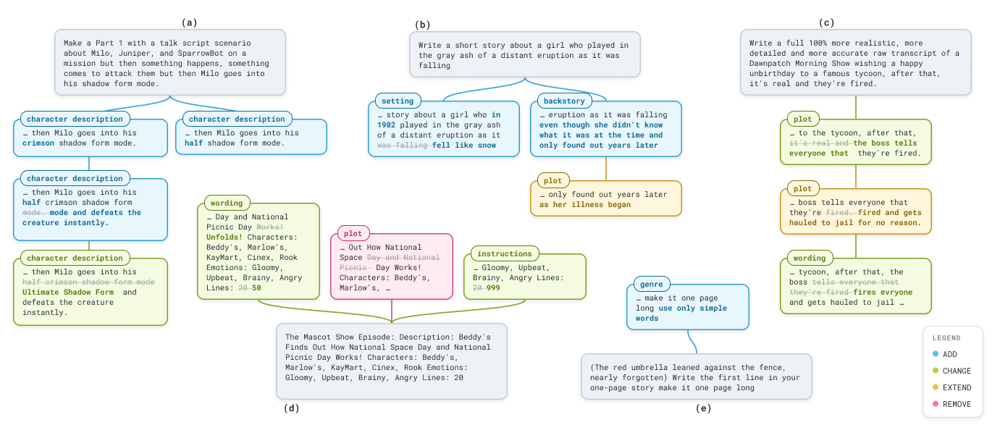
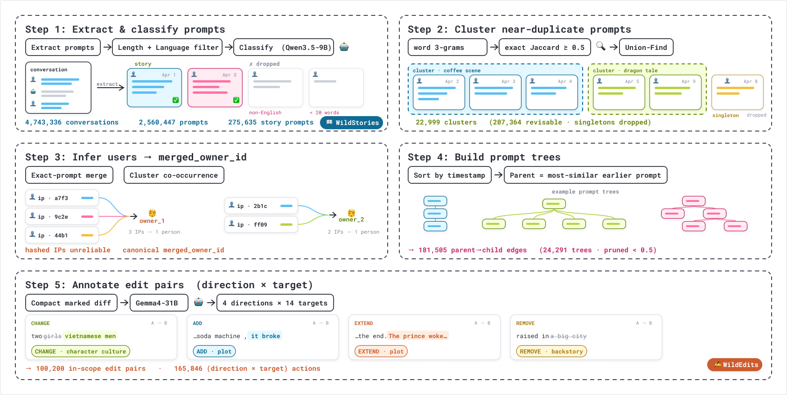

# The Garden of Forking Prompts

Datasets and code for studying how people iteratively edit their story prompts when writing fiction with chatbots.

> **Content warning.** These are wild chatbot logs. A large share of the corpus is sexually explicit or otherwise toxic, and rehydrating from WildChat will put that text in front of you.

<table>
<tr>
<td width="50%"><a href="figures/edit_trees.png"></a></td>
<td width="50%"><a href="figures/pipeline.png"></a></td>
</tr>
<tr>
<td align="center"><em>Prompt trees, with each edge labeled by direction and target. The prompt text shown is paraphrased.</em></td>
<td align="center"><em>Construction, from WildChat conversations to annotated edit pairs.</em></td>
</tr>
</table>

## COLM Paper

*The Garden of Forking Prompts: How Users Explore Narrative Space in Story Generation.* Advait Deshmukh, Nora Benedict, Melanie Walsh, and Maria Antoniak. Conference on Language Modeling (COLM), 2026. [OpenReview](https://openreview.net/forum?id=w6VGVCw4FF)

The release itself lives at <https://github.com/advaitdeshmukh/The-Garden-of-Forking-Prompts>.

## Quick Start

The analysis notebook runs offline from the tables in `data/`. It needs no WildChat access and no rehydration.

```bash
python -m pip install -r requirements.txt
jupyter lab notebooks/analysis.ipynb
```

## 📖 WildStories

275,635 story generation prompts drawn from WildChat, labeled with story format, prompt components, and explicit content.

| File | Contents |
| --- | --- |
| `wildstories.jsonl.gz` | Story-prompt structure, content, and refusal labels |

`any_sensitive` is a derived field: exactly `sexual_content OR body_humor OR fetish_content`. Use it as a shorthand for those three labels.

WildChat's terms don't let us redistribute conversations. The release is therefore *dehydrated*: it carries identifiers and labels only. `prompt_id` is the normalized `turn_identifier` of a WildChat user turn. [DATA.md](data/DATA.md) has the field-by-field schemas.

## ✍️ WildEdits

24,291 edit trees over those prompts, reconstructed from lexical similarity and timestamps. They carry 100,200 labeled prompt pairs and 165,932 edit actions across four directions and fourteen targets.

| File | Contents |
| --- | --- |
| `wildedits_trees.jsonl.gz` | Non-singleton edit-tree summaries |
| `wildedits_nodes.jsonl.gz` | Prompt membership and position in each tree |
| `wildedits_edges.jsonl.gz` | Parent-child links, similarity, elapsed time, and scope |
| `wildedits_actions.jsonl.gz` | Edit targets, directions, and text-free span IDs |

## Rehydration

Prompt and response text comes from WildChat. Request access to [WildChat-4.8M-Full](https://huggingface.co/datasets/yuntian-deng/WildChat-4.8M-Full), authenticate with Hugging Face, then run [rehydrate.ipynb](notebooks/rehydrate.ipynb). It streams the source, restores prompts and responses, and rebuilds the diff spans behind each edit action.

```bash
jupyter lab notebooks/rehydrate.ipynb
```

Rehydration pins the WildChat revision the release was verified against, `eedff4afb0239e69217ffd1c276e2ba45bbfdd45`. Every action in the release resolves against that snapshot, so pinning it keeps span reconstruction reproducible as the upstream dataset changes. Pass `revision=None` to take whatever WildChat currently serves.

To work from a different WildChat snapshot, set `dataset_name` or `revision`, or pass records straight to `rehydrate_from_records`. Missing identifiers raise a warning. The released trees describe the full snapshot. Recompute clustering, parent selection, and pruning before you treat a subset as a topology of its own.

Rehydration also picks up three fields that the release does not publish but the construction pipeline needs: the record's `timestamp`, the turn's position within it, and `hashed_ip`. `helpers.pipeline_inputs` shapes them for `pipeline.build_trees` and `pipeline.merge_users_by_cluster`. With those you can rerun construction end to end from WildChat.

## Analysis

From the release tables, [analysis.ipynb](notebooks/analysis.ipynb) computes corpus and tree statistics, the edit tables and matrices, explicit-content and refusal comparisons, resend rates, and jailbreak position.

Four sections need rehydrated text and are off by default: lexical specificity, word-level PMI and edit volume (Figure 14), the corpus word-length and source-IP summaries, and the tree-rebuilding check. A prompt that fails to rehydrate counts as missing. It drops out of the analysis, and the coverage is reported next to the result.

## Code

| Module | Contents |
| --- | --- |
| [code/analysis_lib.py](code/analysis_lib.py) | Estimators and figure styling for the analysis notebook |
| [code/specificity.py](code/specificity.py) | Lexical specificity, following Zhang et al. (2017) |
| [code/pipeline.py](code/pipeline.py) | Construction: prefix shingling and clustering, inferred-user merging, temporal parent selection, pruning |
| [code/helpers.py](code/helpers.py) | WildChat rehydration and diff-span reconstruction |

## Prompts

The model instruction templates reported in Appendix C are in [prompts/](prompts/), one file per task.

## Citation

```bibtex
@inproceedings{deshmukh2026forkingprompts,
  title     = {The Garden of Forking Prompts: How Users Explore Narrative Space in Story Generation},
  author    = {Deshmukh, Advait and Benedict, Nora and Walsh, Melanie and Antoniak, Maria},
  booktitle = {Third Conference on Language Modeling},
  year      = {2026},
  url       = {https://openreview.net/forum?id=w6VGVCw4FF}
}
```

## Questions

Please open an issue, or contact the first author.

---

No WildChat prompt text, response text, extracted span text, or IP hashes appear anywhere in this repository.
